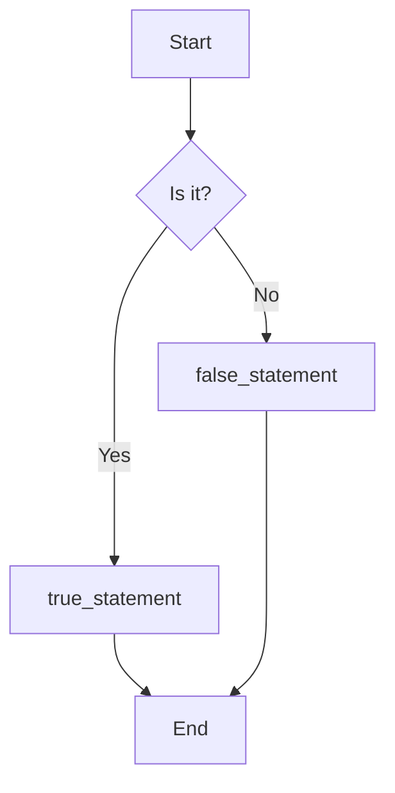
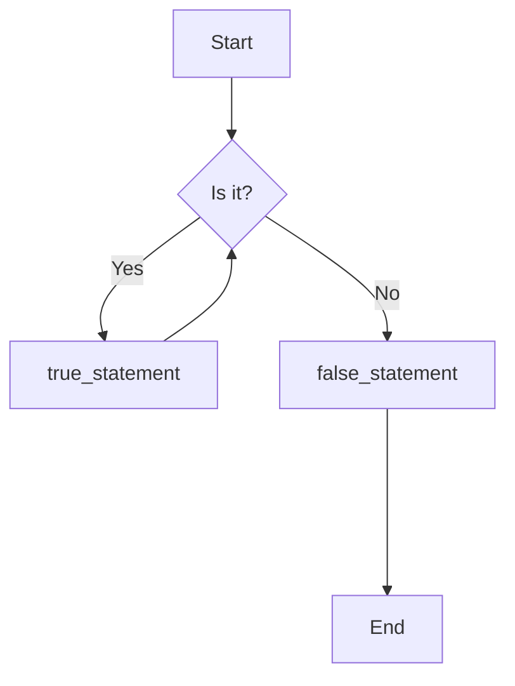
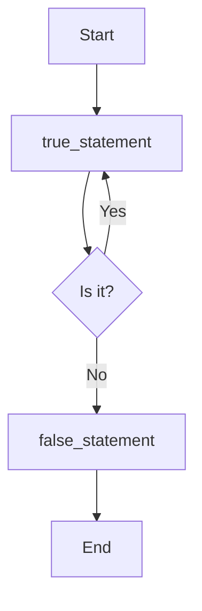

# C Programming Guide _11_

## 1. Structure of C program

A C program is composed of one or more source files. Each file contains declarations, definitions, and functions. The build system stitches them together into a single executable.

**Minimal single-file layout:**

```c
#include <stdio.h>          // Preprocessor directive — paste stdio declarations here

int add(int x, int y);      // Forward declaration (prototype)

int main(void)              // Entry point
{
    printf("%d", add(1, 34));
    return 0;
}                           // exit point

int add(int x, int y)       // Definition
{
    return x + y;
}
```

### The main() Function

`main()` is the entry point of every C program. When the OS launches the program, execution starts at the top of `main()` and terminates at its `return` statement (or the end of `main()`).

```c
int main(void)
{
    // your code goes here
    return 0;  // return 0 signals successful execution to the OS
}
```

`main()` can also accept command-line arguments:

```c
int main(int argc, char *argv[])
{
    // argc = argument count
    // argv = argument vector (array of strings)
    return 0;
}
```

> [!Note]
> `return 0` from `main()` signals success to the operating system. A non-zero value signals an error.

### Build Process

A C source file passes through three stages before it becomes an executable.

$$\text{Source Code (.c)} \xrightarrow{-E} \text{Preprocessed Text (.i)} \xrightarrow{-S} \text{assembled text (.s)}\xrightarrow{-c} \text{Object File (.o)} \xrightarrow{\text{Link}} \text{Executable}$$

| Stage | Command | Output |
|---|---|---|
| Preprocessor | `gcc -E file.c -o file.i` | Expanded text (macros resolved, comments removed) |
| Compiler | `gcc -S file.i -o file.s` | Assembly text |
| Assembler | `gcc -c file.s -o file.o` | Binary object file |
| Linker | `gcc file.o -o program` | Runnable executable |

<!-- raw linker are messy
```bash 
ld mainFile.o /usr/lib/crt1.o /usr/lib/libc.so ... -o mainFile.exe  # messy 
```-->

One-shot build:  - VS Code shortcut key `(ctrl + alt + N)`

```bash
gcc weather.c -o main.exe    # Creates an executable file
```

In short: the preprocessor prepares source text → the compiler translates it into isolated machine-code modules → the linker binds those modules into a complete application.

**[Check your C standard version](../codeContainer/checkVersion.c)**

---

## 2. C Preprocessor and Header files 

Before compilation, the preprocessor scans the source file top-to-bottom looking for lines starting with `#`. These are called **directives** — they end with a newline, not a semicolon.

### `#include`

Tells the preprocessor to find a file and copy-paste its entire contents at that exact position.

```c
#include <stdio.h>    // System header (angle brackets — searches standard paths)
#include "myfile.h"   // Local header (quotes — searches current directory first)
```

The directive is replaced by thousands of lines of declarations (like `printf`'s prototype), making them available to your code.

### `#define` -- Object like Macros

An object like macro is a constant identifier. The preprocessor blindly replaces every occurrence of the name with the substitution text before compilation.

```c
#include <stdio.h>
#define PI 3.14159

int main() {
    printf("Value of PI: %f", PI);  // Preprocessor replaces PI with 3.14159
    return 0;
}
```

### `#define` — Function-like Macros

Look like function calls but perform simple textual argument substitution. No call overhead.

```c
#include <stdio.h>
#define areaOfCircle(r) (3.14159 * (r) * (r))

int main() {
    printf("Area: %f", areaOfCircle(7));  // Expands inline at compile time
    return 0;
}
```

### `#define` — Flag Macros (No Substitution Text)

A macro can be defined without any replacement text. The preprocessor simply records that it exists. Used primarily in header guards.

```c
#define MY_HEADER_H   // No value — just flags its existence
```

### Conditional Compilation

Controls which blocks of code are included in the build, based on compile-time conditions.

| Directive | Meaning |
| :--- | :--- |
| `#ifdef NAME` | Include block if `NAME` is defined |
| `#ifndef NAME` | Include block if `NAME` is NOT defined |
| `#if EXPR` | Include block if expression is true |
| `#elif EXPR` | Else-if alternative condition |
| `#else` | Fallback block |
| `#endif` | Closes a conditional block |

**Header guard pattern** — prevents a header file from being included more than once:

```c
/* ==========================================
   FILE: customHeader.h
   ========================================== */
#ifndef CUSTOM_HEADER_H
#define CUSTOM_HEADER_H

int add(int firstNumber, int secondNumber)
{
    return firstNumber + secondNumber;
}

#endif
```

```c
/* ==========================================
   FILE: main.c
   ========================================== */
#include "./customHeader.h"
#include <stdio.h>

int main(void)
{
    printf("%d", add(1, 34));
    return 0;
}
```

---

## 3. Comment

### Single line Comment `//`  - VS code shortcut key `(ctrl + /)`

Comments everything from `//` to the end of the line.

```c
int x = 5; // this is a single-line comment
// this entire line is a comment
int y = x + 1; // y is now 6
```

### Multi line Comment `/* ... */`

Spans multiple lines — everything between /* and */ is ignored.

```c
/* This is a
   multi-line
   comment */
int result = 0; /* also works inline */
```

> [!CAUTION] What NOT to do
>
> - Nested comments are not allowed — `/* outer /* inner */ */` causes a compile error; the first `*/` closes the comment.
> - Avoid obvious comments — `// increment i by 1` for `i++` adds no value.
> - Do not leave dead code commented out permanently — use version control instead.

> [!NOTE] Things to remember
>
> - Comments are removed by the preprocessor before compilation.
> - Comments doesn't work inside string literals.

---

## 4. Initialization and Uninitialization

Initialization means giving a variable a specific value at the exact moment it is created in memory.

### Supported Initialization Style in C — Copy Initialization

The standard C method. Uses the assignment operator `=` to copy a value into the newly allocated memory slot.

```c
int a = 2;  // Copy initialization (valid C syntax)
```

### Uninitialized Variables

A variable that has been declared but not given an initial value. Its memory slot contains whatever random bytes were there before — this is called **garbage data**.

```c
int point;  // Uninitialized local variable — contains a random value
```

> [!WARNING] Reading an uninitialized variable is undefined behavior — it could print garbage, crash, or produce silent wrong answers.

**Example showing the difference:**

```c
#include <stdio.h>

int main() {
    int points;              // Uninitialized — garbage!
    int pointGained = 20;    // Copy initialization
    int pointLost   = 10;    // Copy initialization

    points = pointGained - pointLost;  // Assignment (not initialization)

    printf("%d", points);   // Output: 10
    return 0;
}
```

---

## 5. Identifiers and Keywords

### Objects

In C, an **object** is a technical term from the language standard — not an OOP concept.

- **Definition:** A region of data storage in memory that can hold a value.
- **Examples:** `int`, `char`, `struct`, `union`, or dynamically allocated memory via `malloc()`.
- Every object has a fixed size in bytes, queryable at compile time with the `sizeof` operator.

> [!NOTE]
> `sizeof` is an operator (evaluated at compile time), not a runtime function call.

### Variables

A variable is an object that has been given a name in your code so you can reference and manipulate it.

```c
int age = 25;  // "age" is a variable (and therefore also an object)
```

> [!NOTE]
> All variables are objects, but not all objects are variables. Unnamed memory allocated by `malloc()` and literals is an object, but not a variable.

### Keywords Reference

#### Data Types

| Keyword | Category | Explanation |
| :--- | :--- | :--- |
| `char` | Data Type | Character type (1 byte, stores ASCII values) |
| `double` | Data Type | Double-precision floating-point type |
| `float` | Data Type | Single-precision floating-point type |
| `int` | Data Type | Signed integer type |
| `long` | Type Modifier | Extends storage capacity of integer or double |
| `short` | Type Modifier | Reduces storage capacity of integer |
| `signed` | Type Modifier | Integer holds positive and negative values (default) |
| `unsigned` | Type Modifier | Integer holds only non-negative values |
| `_Bool` | Data Type | Boolean type (use `<stdbool.h>` for the `bool` alias) |
<!-- | `void` | Data Type | No type / empty type | -->
<!-- | `enum` | Data Type | User-defined set of named integer constants | -->

> [!NOTE]
> C does NOT have `bool` as a built-in keyword before C23. Use `_Bool` or `#include <stdbool.h>` for the `bool` macro.

### Type Qualifiers

| Keyword | Explanation |
| :--- | :--- |
| `const` | Object is read-only after initialization |
<!-- | `restrict` | Pointer is the only reference to that data — enables optimization (C99+) |
| `volatile` | Value may change outside program control (hardware, signals) — prevents aggressive optimization | -->

### Storage Class Specifiers

| Keyword | Explanation |
| :--- | :--- |
| `static` | Static storage duration (lives entire program) OR internal linkage |
<!-- | `auto` `???dyor` | Automatic storage duration (default for local variables — rarely written explicitly) | -->
<!-- | `register` | Hint to store in CPU register (obsolete, ignored by modern compilers) | -->
<!-- | `extern` | Variable/function defined in another translation unit | -->
<!-- | `typedef` | Creates a type alias | -->

### Control Flow

| Keyword | Explanation |
| :--- | :--- |
| `break` | Exit the innermost loop or switch |
| `case` | Label inside a switch statement |
| `continue` | Skip to the next loop iteration |
| `default` | Default case in a switch |
| `do` | Start a post-condition loop (do-while) |
| `else` | Alternative branch for an if statement |
| `for` | Pre-condition loop with initialization, condition, and increment |
| `goto` | Unconditional jump to a label (discouraged) |
| `if` | Conditional branching |
| `return` | Exit a function and optionally return a value |
| `switch` | Multi-way branch based on an integer or enum value |
| `while` | Pre-condition loop |

### Structure and Composite Types

| Keyword | Explanation |
| :--- | :--- |
| `struct` | Composite type — members are independent (public by default) |
| `union` | All members share the same memory location |
<!-- | `enum` | Named integer constants | -->

> [!NOTE]
> C has NO `class`, `this`, `new`, `delete`, `private`, `protected`, `public`, or `virtual`. Those are C++ only.

<!-- ### Other Keywords

| Keyword | Explanation |
| :--- | :--- |
| `sizeof` | Returns the size in bytes of a type or expression (compile-time operator) |
| `inline` | Suggests function expansion inline — avoids call overhead (C99+) |
| `_Alignas` | Specify alignment requirement (C11+) |
| `_Alignof` | Query alignment requirement (C11+) |
| `_Atomic` | Declare an atomic type (C11+) |
| `_Static_assert` | Compile-time assertion (C11+) |
| `_Thread_local` | Thread-local storage duration (C11+) | -->

> [!NOTE]
> Starting in C23, `auto` was officially changed to automatically infer the data type from the initializer.

### Identifier Naming Rules

An **identifier** is the name you give to a variable, function, type, or any other user-defined item.

### Rule 1 — No Reserved Keywords

An identifier cannot be a C keyword.

```c
Invalid: int int = 5;     float double = 3.14;
Valid:   int internal_value = 5;
```

### Rule 2 — Allowed Characters Only

An identifier may only contain:
- Letters: `a–z`, `A–Z`
- Digits: `0–9`
- Underscores: `_`

```c
Invalid: int user age = 20;      (space)
Invalid: int account-num = 101;  (hyphen)
Valid:   int user_age = 20;
Valid:   int accountNum101 = 101;
```

### Rule 3 — Must Start with a Letter or Underscore

An identifier cannot start with a digit.

```c
Invalid: int 3rd_position = 12;
Valid:   int position_3 = 12;       (snake_case)
Valid:   int _temp_value = 0;       (unconventional, rarely used)
Valid:   int positionThreeTwo = 12; (camelCase)
```

### Rule 4 — Case Sensitive

`age`, `Age`, and `AGE` are three different identifiers.

### Naming Conventions

| Style | Example | Used For |
| :--- | :--- | :--- |
| `snake_case` | `user_age` | Local variables, function, parameters |
| `camelCase` | `userAge` | Common in mixed C/C++ codebases |
| `UPPER_SNAKE_CASE` | `MAX_USERS` | Constants (`const`, `#define`) |
| `PascalCase` | `UserRecord` | Struct and typedef names |

---

## 6. Basic Data Types

### `sizeof` Operator

Determines the size of a type or variable in bytes at compile time.

```c
#include <stdio.h>
#include <stdint.h>
#include <stddef.h>
#include <stdbool.h>

int main() {
    printf("char       = %zu byte\n",  sizeof(char));
    printf("int        = %zu bytes\n", sizeof(int));
    printf("long       = %zu bytes\n", sizeof(long));
    printf("long long  = %zu bytes\n", sizeof(long long));
    printf("float      = %zu bytes\n", sizeof(float));
    printf("double     = %zu bytes\n", sizeof(double));
    printf("bool       = %zu byte\n",  sizeof(bool));
    printf("void*      = %zu bytes\n", sizeof(void *));
    return 0;
}
```

### Fundamental Data Type Sizes

| Category | Type | Minimum Size | Typical Size |
| :--- | :--- | :--- | :--- |
| **Boolean** | `_Bool` / `bool` | 1 byte | 1 byte |
| **Character** | `char` | 1 byte (exactly) | 1 byte |
| **Integral** | `short` | 2 bytes | 2 bytes |
| | `int` | 2 bytes | 4 bytes |
| | `long` | 4 bytes | 4 or 8 bytes |
| | `long long` | 8 bytes | 8 bytes |
| **Floating point** | `float` | 4 bytes | 4 bytes |
| | `double` | 8 bytes | 8 bytes |
| | `long double` | 8 bytes | 8, 12, or 16 bytes |
| **Pointer** | any pointer `*` | 4 bytes | 4 or 8 bytes |
| **Void** | `void` | No size | No size |


> **GCC Extension:** Without strict flags, GCC treats `sizeof(void)` as 1 byte. This is non-standard — don't confuse `void` with `void*`.

### Type Meanings

| Types | Category | Meaning | Example |
| :--- | :--- | :--- | :--- |
| `float`, `double`, `long double` | Floating Point | A number with a fractional part | `3.14159` |
| `_Bool` / `bool` | Boolean | Truth value: `1` (true) or `0` (false) | `true` |
| `char` | Character | A single character — stored as its ASCII integer value | `'c'` |
| `short`, `int`, `long`, `long long` | Integer | Positive and negative whole numbers, including 0 | `64` |
| `void` | Incomplete Type | No value / generic pointer via `void*` | — |

### Floating-Point Numbers (`float`, `double`)

Stores real numbers with a fractional component (e.g., `4320.0`, `-3.33`, `0.01226`).

| Type | Precision | Total Bits | Accurate to |
| :--- | :--- | :---: | :--- |
| `float` | Single | 32 bits | ~6–7 decimal places |
| `double` | Double | 64 bits | ~15–17 decimal places |

---

## 7. Variables and Constant

### Standard Integer Types - Integral Type

Used to store whole numbers (positive and negative). Variants differ only in memory size and range.

```c
short     age = 25;    // 2 bytes
int       age = 25;    // 4 bytes (most common)
long      age = 25;    // 4 or 8 bytes
long long age = 25;    // 8 bytes (guaranteed)
```

### Boolean (`_Bool` / `bool`) - Integral Type

Stores a truth value. Internally, `false = 0` and `true = 1`.

```c
#include <stdbool.h>

bool isRaining     = true;
bool hasUmbrella   = false;
```

> [!NOTE]
> An uninitialized `_Bool` / `bool` contains 0 (false) if it is global; garbage if it is local.

### Character Types (`char`) - Integral Type

Stores a single character in single quotes. A `char` does not store the letter itself — it stores the ASCII integer code of the character.

```c
char c = 'A';
// Stored internally as: c = 65  (ASCII code for 'A')
```

> **Key insight:** A character is not a special object in C — it is just an integer that represents a symbol.

#### ASCII Code

| Code | Symbol | Code | Symbol | Code | Symbol | Code | Symbol |
| :--- | :--- | :--- | :--- | :--- | :--- | :--- | :--- |
| **0** | NUL (null) | **32** | (space) | **64** | @ | **96** | ` |
| **1** | SOH (start of header) | **33** | ! | **65** | A | **97** | a |
| **2** | STX (start of text) | **34** | " | **66** | B | **98** | b |
| **3** | ETX (end of text) | **35** | # | **67** | C | **99** | c |
| **4** | EOT (end of transmission) | **36** | $ | **68** | D | **100** | d |
| **5** | ENQ (enquiry) | **37** | % | **69** | E | **101** | e |
| **6** | ACK (acknowledge) | **38** | & | **70** | F | **102** | f |
| **7** | BEL (bell) | **39** | ' | **71** | G | **103** | g |
| **8** | BS (backspace) | **40** | ( | **72** | H | **104** | h |
| **9** | HT (horizontal tab) | **41** | ) | **73** | I | **105** | i |
| **10** | LF (line feed/new line) | **42** | * | **74** | J | **106** | j |
| **11** | VT (vertical tab) | **43** | + | **75** | K | **107** | k |
| **12** | FF (form feed / new page) | **44** | , | **76** | L | **108** | l |
| **13** | CR (carriage return) | **45** | - | **77** | M | **109** | m |
| **14** | SO (shift out) | **46** | . | **78** | N | **110** | n |
| **15** | SI (shift in) | **47** | / | **79** | O | **111** | o |
| **16** | DLE (data link escape) | **48** | 0 | **80** | P | **112** | p |
| **17** | DC1 (data control 1) | **49** | 1 | **81** | Q | **113** | q |
| **18** | DC2 (data control 2) | **50** | 2 | **82** | R | **114** | r |
| **19** | DC3 (data control 3) | **51** | 3 | **83** | S | **115** | s |
| **20** | DC4 (data control 4) | **52** | 4 | **84** | T | **116** | t |
| **21** | NAK (negative acknowledge) | **53** | 5 | **85** | U | **117** | u |
| **22** | SYN (synchronous idle) | **54** | 6 | **86** | V | **118** | v |
| **23** | ETB (end of transmission block) | **55** | 7 | **87** | W | **119** | w |
| **24** | CAN (cancel) | **56** | 8 | **88** | X | **120** | x |
| **25** | EM (end of medium) | **57** | 9 | **89** | Y | **121** | y |
| **26** | SUB (substitute) | **58** | : | **90** | Z | **122** | z |
| **27** | ESC (escape) | **59** | ; | **91** | [ | **123** | { |
| **28** | FS (file separator) | **60** | < | **92** | \ | **124** | \| |
| **29** | GS (group separator) | **61** | = | **93** | ] | **125** | } |
| **30** | RS (record separator) | **62** | "`>`" | **94** | ^ | **126** | ~ |
| **31** | US (unit separator) | **63** | ? | **95** | _ | **127** | DEL (delete) |


### Type Conversion (C-Style Cast)   <!-- Not important for topic extra knowledge -->

```c
dataType newVar = (dataType) existingVar;
```

```c
int total = 1234, count = 126;
double result_1 = total / count;            // 9.000000  (integer division)
double result_2 = (double)total / count;    // 9.793651  (float division)
```

> [!NOTE]
> With a C-style cast, `total` is temporarily treated as `double` before the division, producing a floating-point result. ???reason??? - type promotion hierarchy

> [!NOTE] The C++ / C Type Promotion Hierarchy
>->o When a ternary operator (`? :`) or arithmetic expression contains mixed types, the compiler automatically promotes the lower type to match the higher type.
> $$\begin{array}{c}
\textbf{double } \text{(Highest precision)} \\
\uparrow \\
\textbf{float}\\
\uparrow\\
\textbf{unsigned long long}\\
\uparrow\\
\textbf{long long}\\
\uparrow\\
\textbf{unsigned int}\\
\uparrow\\
\textbf{int } \text{(Standard integer)}\\
\uparrow\\
\textbf{char / short / bool } \\
\end{array}$$ 

> [!NOTE]
> `char` / `short` / `bool` (Automatically promoted to int before anything else happens)


### Constants

A $$constant$$ is a fixed value that cannot be changed after it is set.

| Category | Timing | Examples |
| :--- | :--- | :--- |
| **Compile-time constant** | Known at compile time | Literals, `const` variables initialized with literals |
| **Runtime constant** | Determined at runtime | `const` function parameters, `const` vars from runtime input |

### Named Constants

#### `const` Variables

```c
const int MY_AGE = 25;
```

> **Convention:** Use `UPPER_SNAKE_CASE` for constant names to distinguish them from regular mutable variables.

#### `#define` Macros

```c
#define EARTH_GRAVITY 9.8   // Substituted at preprocessing, before compilation
```

---

## 8. Specifier and Sequence - Output Formatting and Escape Sequences

### Official Definition

A specifier is a special keyword or symbol that acts as an instruction manual for the compiler. It specifies (defines) exactly how the computer should allocate memory, read data, format text, or handle variables.

An escape sequence is a combination of a backslash (\) and one or more following characters that together represent a single character, control code, or special symbol.

> [!WARNING]
> **No, $$Escape Sequence$$ isn't a specifier, neither is it a type  of specifier**

| | Specifier | Escape Sequence |
|---|---|---|
| Example | `%d`, `%f` | `\n`, `\t` |
| Purpose | Instructs how to handle/format data | Represents a character that can't be written literally |
| Acts on | External data/variables | The string itself |
| Used in | Format strings | Any string or character literal |

### Table of  Format Specifiers

| Specifier | Type | Example output |
|---|---|---|
| `%d` | `int` | `42` |
| `%i` | `int` (scanf also reads octal/hex) | `42` |
| `%u` | `unsigned int` | `300` |
| `%ld` | `long int` | `123456` |
| `%f` | `float` / `double` | `3.140000` |
| `%.2f` | float, 2 decimal places | `3.14` |
| `%e` | scientific notation | `1.234560e+04` |
| `%c` | `char` | `A` |
| `%s` | string (`char` array) | `hello` |
| `%p` | pointer address | `0x7ffe...` |
| `%x` | hexadecimal int | `ff` |
| `%o` | octal int | `10` |
| `%%` | literal `%` | `%` |


### Table of escape sequence

| Name | Symbol | Meaning |
| :--- | :--- | :--- |
| **Alert** | `\a` | Makes an alert, such as a beep |
| **Backspace** | `\b` | Moves the cursor back one space |
| **Formfeed** | `\f` | Moves the cursor to next logical page |
| **Newline** | `\n` | Moves cursor to next line |
| **Carriage return** | `\r` | Moves cursor to beginning of line |
| **Horizontal tab** | `\t` | Prints a horizontal tab |
| **Vertical tab** | `\v` | Prints a vertical tab |
| **Single quote** | `\'` | Prints a single quote |
| **Double quote** | `\"` | Prints a double quote |
| **Backslash** | `\\` | Prints a backslash |
| **Question mark** | `\?` | Prints a question mark (No longer relevant; you can use question marks unescaped) |
| **Octal number** | `\(number)` | Translates into char represented by octal |
| **Hex number** | `\x(number)` | Translates into char represented by hex number |

---

## 9. Simple and Compound Statements

### Simple Statements

A simple statement performs one specific operation and ends with a semicolon.

```c
x = a + b;               // Expression statement
printf("Hello\n");       // Function call statement
break;                   // Control flow jump
return 0;                // Control flow jump
```

### Compound Statements (Blocks)

A block groups zero or more statements inside `{ }`. The compiler treats the whole block as a single unit. **No semicolon after the closing brace.**

```c
#include <stdio.h>

int add(int x, int y)
{ // start block
    return x + y;
} // end block

int main()
{ // start block
    add(3, 4);
    return 0;
} // end block
```

**Blocks inside blocks:**

```c
int main()
{
    int addVar = 0;

    {  // inner block
        int random = 3496629634;   // lives only inside this block
        addVar = add(3, 4);
    }  // "random" is destroyed here

    // printf("%d", random);  ERROR: "random" is out of scope
    return 0;
}
```

### Null Statement

A statement consisting of just a semicolon — does nothing.

```c
if (x > 10) ;   // null statement — intentionally empty body
```

> **Warning:** Accidentally putting a `;` after an `if` terminates the `if` body immediately. The intended code block executes unconditionally.

---

## 10. Operator

### All Operator Categories

| Category | Operators | Description |
| :--- | :--- | :--- |
| **Assignment** | `=` `+=` `-=` `*=` `/=` `%=` `&=` `\|=` `^=` `<<=` `>>=` | Simple and compound assignment |
| **Arithmetic** | `+` `-` `*` `/` `%` | Basic math |
| **Increment/Decrement** | `++a` `--a` `a++` `a--` | Prefix and postfix |
| **Bitwise** | `~` `&` `\|` `^` `<<` `>>` | Bit manipulation |
| **Logical** | `!` `&&` `\|\|` | Boolean logic |
| **Comparison** | `==` `!=` `<` `>` `<=` `>=` | Relational checks |
| **Member & Memory** | `a[b]` `*a` `&a` `a->b` `a.b` | Array, pointer, struct access |
| **Other** | `a(...)` `,` `(type)a` `a?b:c` `sizeof` | Function call, comma, cast, ternary, sizeof |

### Operator Precedence (High → Low)

| Prec | Operator | Description | Assoc |
| :---: | :--- | :--- | :---: |
| 1 | `++` `--` `()` `[]` `.` `->` | Postfix, function call, subscript, member | Left→Right |
| 2 | `++` `--` `+` `-` `!` `~` `(type)` `*` `&` `sizeof` | Prefix, unary, cast, dereference | Right→Left |
| 3 | `*` `/` `%` | Multiplicative | Left→Right |
| 4 | `+` `-` | Additive | Left→Right |
| 5 | `<<` `>>` | Bitwise shift | Left→Right |
| 6 | `<` `<=` `>` `>=` | Relational | Left→Right |
| 7 | `==` `!=` | Equality | Left→Right |
| 8 | `&` | Bitwise AND | Left→Right |
| 9 | `^` | Bitwise XOR | Left→Right |
| 10 | `\|` | Bitwise OR | Left→Right |
| 11 | `&&` | Logical AND | Left→Right |
| 12 | `\|\|` | Logical OR | Left→Right |
| 13 | `?:` | Ternary | Right→Left |
| 14 | `=` `+=` `-=` etc. | Assignment | Right→Left |
| 15 | `,` | Comma | Left→Right |

### Arithmetic Operators

| Operator | Symbol | Form | Operation |
| :--- | :---: | :--- | :--- |
| Addition | `+` | `x + y` | x plus y |
| Subtraction | `-` | `x - y` | x minus y |
| Multiplication | `*` | `x * y` | x times y |
| Division | `/` | `x / y` | x divided by y |
| Remainder | `%` | `x % y` | remainder of x divided by y |

> [!WARNING]
> Integer division with a divisor of `0` is undefined behavior. Floating-point division by `0.0` produces `+Inf`, `-Inf` or, `IND00`.

**Floating-point division with integers:**

```c
#include <stdio.h>

int main() {
    printf("%f\n", 10 / 4);         // 2.000000 — integer division (truncates)
    printf("%f\n", (float)10 / 4);  // 2.500000 — float cast forces float division
    return 0;
}
```

**Remainder (modulo) operator:**

```c
7 % 4  == 3   // 4 goes into 7 once, remainder 3
25 % 7 == 4   // 7 goes into 25 three times, remainder 4
2 % 4  == 2   // 4 goes into 2 zero times, remainder is the whole 2
```

**Exponentiation:**

```c
#include <stdio.h>
#include <math.h>   // Required for pow()

int main(void) {
    double result = pow(2.0, 3);   // 2³ = 8  — O(log N) performance
    printf("2^3 = %.1f\n", result);
    return 0;
}
```

### Arithmetic Assignment Operators

$$\text{Left} \xleftarrow{\text{Direction}} \text{Right}$$

| Operator | Form | Equivalent To |
| :---: | :--- | :--- |
| `+=` | `x += y` | `x = x + y` |
| `-=` | `x -= y` | `x = x - y` |
| `*=` | `x *= y` | `x = x * y` |
| `/=` | `x /= y` | `x = x / y` |
| `%=` | `x %= y` | `x = x % y` |

### Increment and Decrement Operators

| Operator | Form | Operation |
| :--- | :--- | :--- |
| Prefix increment | `++x` | Increment x, then return the new value |
| Prefix decrement | `--x` | Decrement x, then return the new value |
| Postfix increment | `x++` | Copy x, increment x, return the copy (old value) |
| Postfix decrement | `x--` | Copy x, decrement x, return the copy (old value) |

```c
int i = 5;
int j = ++i;  // i becomes 6 first, then j = 6   →  i=6, j=6
```

```c
int i = 5;
int j = i++;  // copy of i=5 made, i becomes 6, j = 5   →  i=6, j=5
```

> [!WARNING]
> Never use mutating operators like `++`, `--`, or `=` inside a `printf()` call. Evaluation order is compiler-dependent and produces different results on different machines.

### Relational Operators

| Operator | Form | True when |
| :---: | :--- | :--- |
| `›` <!-- `'>'` --> | `x > y` | x is strictly greater than y |
| `<` | `x < y` | x is strictly less than y |
| `>=` | `x >= y` | x is greater than or equal to y |
| `<=` | `x <= y` | x is less than or equal to y |
| `==` | `x == y` | x equals y |
| `!=` | `x != y` | x does not equal y |

> [!Caution]
> `==` is the equality test. `=` is assignment. These are completely different operators.

### Logical Operators

| Operator | Symbol | Alt (`<iso646.h>`) | Form | Description |
| :--- | :---: | :---: | :---: | :--- |
| Logical NOT | `!` | `not` | `!x` | Inverts truth value |
| Logical AND | `&&` | `and` | `x && y` | True only if both are true |
| Logical OR | `\|\|` | `or` | `x \|\| y` | True if at least one is true |

**Truth table:**

| x | y | `!x` | `!y` | `x && y` | `x \|\| y` |
| :---: | :---: | :---: | :---: | :---: | :---: |
| false | false | true | true | false | false |
| false | true | true | false | false | true |
| true | false | false | true | false | true |
| true | true | false | false | true | true |

> [!WARNING] Short-circuit evaluation
> `&&` and `||` do not always evaluate the right operand. If the left operand determines the result, the right operand is skipped entirely.
> ```c
> int x = 2, y = 2;
> if (x == 1 && ++y == 2)  // x != 1, so ++y is NEVER executed. y stays 2.
> ```

### De Morgan's Laws

When distributing a logical NOT, you must also flip AND↔OR:

$$!(x \;\|\|\; y) \equiv !x \;\&\&\; !y$$
$$!(x \;\&\&\; y) \equiv !x \;\|\|\; !y$$

| x | y | `!(x \|\| y)` | `!x && !y` | Equal? |
| :---: | :---: | :---: | :---: | :---: |
| false | false | true | true | ✓ |
| false | true | false | false | ✓ |
| true | false | false | false | ✓ |
| true | true | false | false | ✓ |

### Ternary (Conditional) Operator

$$\texttt{condition} \;\;?\;\; \texttt{expression}_1 \;\;:\;\; \texttt{expression}_2$$

$$\text{Result} = \begin{cases} \texttt{expression}_1 & \text{if condition is true} \\ \texttt{expression}_2 & \text{if condition is false} \end{cases}$$

```c
#include <stdio.h>
#include <stdbool.h>

int main() {
    bool inBigClassroom = false;
    int classSize = inBigClassroom ? 30 : 20;   // 20
    printf("Class size: %d\n", classSize);
    return 0;
}
```

### Comma Operator

Evaluates the left expression, discards its result, then evaluates and returns the right expression.

```c
int x = (a++, b++);   // a is incremented, then b is incremented, x = b's new value
```

> [!Note]
> The comma is more commonly used as a separator (in function parameters and `for` loops) than as the comma operator.

---

## 11. Expressions

An **expression** is a non-empty sequence of literals, variables, operators, and/or function calls that evaluates to a value.

- The process of executing an expression is called **evaluation**.
- The value produced is the **result** (sometimes called the return value).
- An expression containing two or more operators is called a **compound expression**.

### Dissecting an Expression

```
x = 4 + 5
```

| Part | Role |
| :--- | :--- |
| `x` | Variable — named storage location |
| `4`, `5` | Literals — hardcoded constant values |
| `+` | Arithmetic addition operator |
| `=` | Assignment operator |
| `4 + 5` | Sub-expression |

---

## 12. Input/Output (I/O) Functions


### Input / Output 

#### The `stdio.h` Header

All standard I/O in C comes from:

```c
#include <stdio.h>
```

Three standard streams are always open:

| Stream | Default device | Used for |
|---|---|---|
| `stdin` | keyboard | reading input |
| `stdout` | terminal | printing output |
| `stderr` | terminal | printing error messages |

---

#### Output — `printf()`

Formats and prints data to standard output. Reads variables **by value**.

```c
//printf("Format String", argument1, argument2, ...);  prints formatted text to `stdout`.

#include <stdio.h>

int main(void) {
    int   age  = 20;
    float gpa  = 3.75f;
    char  name[] = "Aarav";

    printf("Name: %s\n", name);
    printf("Age: %d, GPA: %.2f\n", age, gpa);
    return 0;
}
```

#### Input — `scanf()`

Reads data from standard input `stdin`. Because it modifies the variable directly, it requires the variable's **memory address** (passed with the `&` operator).

```c
scanf("Format Specifier", &variable_name);
```

```c
#include <stdio.h>

int main(void) {
    int   age;
    float salary;

    printf("Enter age and salary: ");
    scanf("%d %f", &age, &salary);
    printf("Age=%d, Salary=%.2f\n", age, salary);
    return 0;
}
```
> Never omit the `&` in `scanf()` — it causes undefined behaviour.
> Exception: string (char array) variables already decay to a pointer, so `scanf("%s", name)` (no `&`) is correct.

> [!WARNING]
> `%s` inside `scanf()` stops reading at the first whitespace. Use `fgets()` for full-line input:
>
> ```c
> char name[50];
> fgets(_variableName_, sizeof(_variableName_), stdin);  // Reads until newline or 49 characters
> ```

> [!NOTE]
> ```c 
>char buffer[5];
>```
> `gets(buffer);` has no way of knowing how big your array is. If a user types "abcdefghijklmnop", gets will blindly force all those letters into memory anyway. It overwrites neighboring data, crashes your program, and creates severe security holes.(don't use it)
> 
> `fgets(buffer, 5, stdin);` requires you to tell it the exact size of your array. If the user types a huge word, fgets will safely grab only the first 4 letters (leaving 1 slot for the hidden \0 null-terminator) and ignore the rest, keeping your program perfectly safe.

[Format specifier](#8-specifier-and-sequence---output-formatting-and-escape-sequences)

#### `printf` vs `scanf` — Quick Comparison

| | `printf` | `scanf` |
|---|---|---|
| Direction | Output → screen | Input ← keyboard |
| Needs `&` | No | Yes (for non-array types) |
| Returns | Number of chars written | Number of items successfully read |
| Whitespace in format | Printed as-is | Skips any whitespace in input |


#### `fprintf()` and `stderr`  - for extra knowledge

Use `fprintf()` to print to a specific stream. Print error messages to `stderr` so they appear even when `stdout` is redirected.

```c
#include <stdio.h>

int main(void) {
    int age = -1;

    if (age < 0) {
        fprintf(stderr, "Error: age cannot be negative.\n");
        return 1;
    }
    printf("Age: %d\n", age);
    return 0;
}
```

---

## 13. Control Statements

| Category | Meaning | C Keywords |
| :--- | :--- | :--- |
| **Conditional** | Execute code only if a condition is met | `if`, `else`, `switch` |
| **Jumps** | Move execution to another location | `goto`, `break`, `continue` |
| **Function calls** | Jump to another location and return | function calls, `return` |
| **Loops** | Repeat code until a condition is false | `while`, `do-while`, `for` |
| **Halts** | Terminate the program immediately | `exit()`, `abort()` from `<stdlib.h>` |

### If Statement

```c
if (condition)
    true_statement;
```

```c
if (condition)
    true_statement;
else
    false_statement;
```

$$IF(C) = \begin{cases} T, & \text{if } C = \text{True} \\ F, & \text{if } C = \text{False} \end{cases}$$



> [!Tip] Always use braces '{ }' for both branches, even for single statements. Without braces, only the first statement belongs to the 'if'/'else'.

> [!WARNING] Dangerous unbraced example
>
> ```c
> if (weather)    printf("It is sunny\n");
> else            printf("It is not sunny\n");
>                 printf("It is raining");    // Executes UNCONDITIONALLY — not part of else!
> ```

**Safe braced version:**

```c
if (weather) {
    printf("It is sunny\n");
} else {
    printf("It is not sunny\n");
    printf("It is raining");
}
```

### Braced vs Unbraced Conditional Pairing

| Code Setup | Else Binds To | Behavior |
| :--- | :--- | :--- |
| `if(A)` `if(B)` `else...` | `if(B)` | If A is false, entire structure is skipped — else never runs |
| `if(A){ if(B) else... }` | `if(B)` (inside isolated block) | If A is false, nothing inside executes |
| `if(A){ if(B) } else...` | outer `if(A)` | If A is false, else runs immediately |

### if-else vs if-if

- Use **`if-else`** when only the code after the **first true** condition should run.
- Use **`if-if`** when all true conditions should independently run (prefer `else if` over nested `if-if`).

**Without `else if` — checks every condition even after a match (inefficient):**

```c
if (temperature <= 0)  printf("Freezing\n");
if (temperature <= 10) printf("Pretty cold\n");
if (temperature <= 20) printf("Chilly\n");
if (temperature <= 30) printf("Warm\n");   // true
if (temperature <= 40) printf("Hot\n");    // also true — both print!
```

**With `else if` — stops after the first match (correct):**

```c
if      (temperature <= 0)  printf("Freezing\n");
else if (temperature <= 10) printf("Pretty cold\n");
else if (temperature <= 20) printf("Chilly\n");
else if (temperature <= 30) printf("Warm\n");    // match — skips everything below
else if (temperature <= 40) printf("Hot\n");
else                        printf("Scorching\n");
```

### Switch Statement

Used when choosing between multiple actions based on the value of a single **integral** expression (int, char, bool, enum).

```c
switch (expression)
{
    case VALUE_1:
        // code
        break;

    case VALUE_2:
        // code
        break;

    default:
        // code if no case matches
        break;
}
```

**How it executes:**
1. Expression is evaluated once.
2. Its value is compared against each `case` label.
3. On a match, execution starts at that label.
4. Execution continues until `break` or the end of the switch block.
5. If no case matches, `default` executes (if present).

**Switch with `bool`:**

```c
#include <stdio.h>
#include <stdbool.h>

int main() {
    bool value = true;
    switch (value) {
        case 0: printf("false\n"); break;
        case 1: printf("true\n");  break;
    }
    return 0;
}
```

> [!CAUTION]
> `switch` only works with integral types (`int`, `char`, `bool`, `enum`). Strings and floats cannot be used as switch expressions.

### `goto` Statement

Transfers execution unconditionally to a named label. **Generally discouraged** — it makes code hard to follow and maintain.

```c
goto myLabel;

// ... skipped code ...

myLabel:
    printf("Jumped here!\n");
```

> [!Warning]
> If `goto` jumps over a variable initialization, that variable contains garbage data.

---

### Loops

**Control flow constructs that repeatedly execute a block of code until a condition evaluates to false.**

Flowchart of while and for loop



Flowchart of do-while loop



#### `while` Loop

Checks the condition **before** each iteration. May execute zero times.

```c
while (condition)
    statement;   // or { block }
```

**Execution sequence:**
1. Evaluate `condition`.
2. If `true`, execute the body.
3. Return to step 1.
4. If `false`, exit the loop.

```c
int count = 0;
while (count < 5) {
    printf("%d\n", count);
    count++;
}
```

#### `do-while` Loop

Executes the body **first**, then checks the condition. Guarantees **at least one** iteration.

```c
do {
    statement;
} while (condition);
```

**Execution sequence:**
1. Execute the body.
2. Evaluate `condition`.
3. If `true`, go to step 1.
4. If `false`, exit the loop.

```c
int count = 0;
do {
    printf("%d\n", count);
    count++;
} while (count < 5);
```

#### `for` Loop

Combines initialization, condition, and increment into a single line. Most common loop for a known number of iterations.

```c
for (initialization; condition; increment/decrement)
    statement;   // or { block }
```

**Execution sequence:**
1. Execute `initialization` (once).
2. Evaluate `condition`.
3. If `true`, execute the body.
4. Execute `increment/decrement`.
5. Go to step 2.
6. If `false`, exit the loop.

```c
for (int i = 0; i < 5; i++) {
    printf("%d\n", i);
}
```

#### Loop Control Statements

| Statement | Effect |
| :--- | :--- |
| `break` | Exits the innermost loop or switch immediately |
| `continue` | Skips the rest of the current iteration, goes back to condition check | 
| `return` | Exits the function immediately and passes a value back to the caller. |

---

## 14. Arrays

An array is a fixed-size, contiguous block of memory that holds elements of the same data type. All elements are stored sequentially, and each is accessible via an index starting at `0`.

Syntax:

```c
dataType array_name[size];
int numbers[5];
float prices[10];
char name[20];
```

### At Declaration

```c
int nums[5] = {10, 20, 30, 40, 50};
```

### Partial Initialization (rest defaults to 0)

```c
int nums[5] = {1, 2};  // {1, 2, 0, 0, 0}
```

### Without Size (compiler infers it)

```c
int nums[] = {5, 10, 15};  // size = 3
```

### Zero-initialize All Elements

```c
int nums[5] = {0};  // {0, 0, 0, 0, 0}
```

### Accessing Elements

```c
array_name[index]
```

```c
int nums[3] = {10, 20, 30};
printf("%d\n", nums[0]);  // 10
printf("%d\n", nums[2]);  // 30
```

> [!CAUTION]
> Index starts at `0`. Valid range: `0` to `size - 1`. 

### Modifying Elements

```c
nums[1] = 99;  // Change second element to 99
```

### Traversing an Array

```c
int nums[5] = {1, 2, 3, 4, 5};
int n = 5;

for (int i = 0; i < n; i++) {
    printf("%d ", nums[i]);
}
```

### Arrays and Pointers

```c
int nums[3] = {10, 20, 30};
int *p = nums;       // p points to nums[0]

printf("%d\n", *p);       // 10
printf("%d\n", *(p+1));   // 20
printf("%d\n", *(p+2));   // 30
```

Pointer arithmetic advances by `sizeof(data_type)` bytes. whose data_type -> data type of the pointer

### Passing Arrays to Functions

Arrays are passed by reference (as a pointer to the first element):

```c
void printArray(int arr[], int size) {
    for (int i = 0; i < size; i++) {
        printf("%d ", arr[i]);
    }
}

int main() {
    int nums[] = {1, 2, 3, 4};
    printArray(nums, 4);
    return 0;
}
```

Equivalent function signatures:

```c
void printArray(int arr[], int size)
void printArray(int *arr, int size)   // same thing
```

> [!CAUTION]
> `sizeof(arr)` inside the function gives the pointer size, not the array size. Always pass size separately.

### Multidimensional Arrays

#### 2D Array (Matrix)

```c
int matrix[3][4];  // 3 rows, 4 columns
```

Initialization:

```c
int matrix[2][3] = {
    {1, 2, 3},
    {4, 5, 6}
};
```

Access:

```c
matrix[1][2]  // row 1, column 2 → 6
```

Traversal:

```c
for (int i = 0; i < 2; i++) {
    for (int j = 0; j < 3; j++) {
        printf("%d ", matrix[i][j]);
    }
    printf("\n");
}
```

#### 3D Array

```c
int cube[2][3][4];  // 2 blocks, 3 rows, 4 columns
```

[Example](../codeContainer/arrrayPointerSizeExample.c)

### Passing 2D Arrays to Functions

```c
void print2D(int arr[][3], int rows) {
    for (int i = 0; i < rows; i++)
        for (int j = 0; j < 3; j++)
            printf("%d ", arr[i][j]);
}
```

The column size must be specified in the parameter.

---

#### Character Arrays (Strings)

In C, strings are character arrays terminated by `\0`:

```c
char name[] = "Hello";       // {'H','e','l','l','o','\0'}
char name[6] = "Hello";      // same
```

#### Array of Strings

```c
char fruits[3][20] = {"Apple", "Banana", "Cherry"};

for (int i = 0; i < 3; i++) {
    printf("%s\n", fruits[i]);
}
```

---

## 15. String

A **string** in C is a null-terminated array of `char` values. There is no built-in string type.

| Operation | Standard C | Time Complexity |
| :--- | :--- | :---: |
| Type Definition | `char str[] = "Text";` | — |
| Memory Allocation | Fixed at compile time | — |
| Finding Length | `strlen(str)` | $O(N)$ |
| Safe Copying | `strncpy(dest, src, size)` | $O(N)$ |
| Concatenation | `strcat(dest, src)` | $O(N)$ |
| Comparison | `strcmp(str1, str2)` | $O(N)$ |

### Null Termination

Every C string ends with `'\0'` (the null character, value 0). Functions like `printf` and `strlen` read memory byte-by-byte until they find `'\0'`.

```
"how is weather?" is stored as:
'h','o','w',' ','i','s',' ','w','e','a','t','h','e','r','?','\0'
```

```c
char msg[] = "Here \0 the rest is ignored";
printf("%s\n", msg);  // Outputs: "Here " — stops at the first \0
```

### String Input

`scanf("%s", ...)` stops at the first whitespace — it cannot read full names.

```c
char name[50];
scanf("%s", name);           // Reads only "John" from "John Smith"
```

**Solution — use `fgets()` for full-line input:**

```c
char name[50];
fgets(name, sizeof(name), stdin);   // Reads up to 49 chars or a newline, appends '\0'
```

`fgets(_variableName_, _sizeOfTheVariable_ , FILE *stream)`

### String Output

```c
char name[50] = "World";
printf("%s\n", name);    // Prints characters from name[0] until '\0'
```

### `strlen()` — String Length

- **Header:** `<string.h>`
- **Performance:** $O(N)$ — traverses every character until `'\0'`
- Does NOT count the null terminator

```c
#include <stdio.h>
#include <string.h>

int main() {
    char text[] = "Data";
    size_t length = strlen(text);            // 4  (does not count '\0')
    printf("Length:      %zu\n", length);
    printf("Memory used: %zu bytes\n", sizeof(text));  // 5  (counts '\0')
    return 0;
}
```

### `strcat()` — String Concatenation

- **Header:** `<string.h>`
- **Performance:** $O(N)$ — finds the `'\0'` in destination, appends source there
- **Requirement:** destination buffer must have enough space to hold both strings

```c
char greeting[20] = "Hello ";   // Must have space for the addition!
char name[]       = "World";

strcat(greeting, name);
printf("%s\n", greeting);   // Output: "Hello World"
```

### `strncpy()` — Safe String Copy

- **Header:** `<string.h>`
- **Performance:** $O(N)$
- Always use `strncpy()` instead of `strcpy()` — `strcpy()` overflows the buffer if the source is too large

```c
char src[]   = "Secure";
char dest[10];

strncpy(dest, src, sizeof(dest) - 1);   // Copy, leaving 1 slot for '\0'
dest[sizeof(dest) - 1] = '\0';          // Manually guarantee null-termination

printf("Copied: %s\n", dest);   // Output: "Secure"
```

### `strcmp()` — String Comparison

- **Header:** `<string.h>`
- **Performance:** $O(N)$
- Never use `==` to compare strings — it compares memory addresses, not contents

**Return values:**

| Return | Meaning |
| :---: | :--- |
| `0` | Strings are identical |
| `< 0` | `str1` comes before `str2` alphabetically |
| `> 0` | `str1` comes after `str2` alphabetically |

```c
char pass1[] = "Apple";
char pass2[] = "Apple";

if (strcmp(pass1, pass2) == 0)
    printf("Strings match!\n");
else
    printf("Strings do not match.\n");
```

### `strrev()` — Reversing a String

- **Header:** `<string.h>`
- `strrev()` exists only on Windows compilers. Use a custom implementation for cross-platform code.

```c
// Windows only
char word[] = "Radar";
strrev(word);
printf("%s\n", word);   // Output: radaR
```

**Cross-platform implementation:**

```c
#include <stdio.h>
#include <string.h>

char* custom_strrev(char *str) {
    if (!str) return NULL;   // Safety check for NULL pointer

    int start = 0;
    int end   = (int)strlen(str) - 1;
    char temp;

    while (start < end) {
        temp       = str[start];
        str[start] = str[end];
        str[end]   = temp;
        start++;
        end--;
    }
    return str;
}

int main() {
    char text[] = "Apple";
    custom_strrev(text);
    printf("Reversed: %s\n", text);   // Output: elppA
    return 0;
}
```

### String Pointers

| Syntax | Pointer (Address) | Data (Characters) | What you can do |
| :--- | :---: | :---: | :--- |
| `char* str` | Modifiable | Modifiable | Full freedom — redirect pointer and edit characters |
| `const char* str` | Modifiable | Read-Only | Can redirect pointer, cannot edit characters |
| `char* const str` | Read-Only | Modifiable | Locked to one address, can edit characters |
| `const char* const str` | Read-Only | Read-Only | Completely locked — read only |

```c
#include <stdio.h>

int main(void) {
    char var1[] = "Hello";
    char var2[] = "World";

    const char* str1 = var1;
    str1 = var2;            // LEGAL: pointer can be redirected
    // str1[0] = 'M';       // ILLEGAL: characters are read-only

    char* const str2 = var1;
    str2[0] = 'M';          // LEGAL: data at var1 can be changed → "Mello"
    // str2 = var2;         // ILLEGAL: cannot change the address

    const char* const str3 = var1;
    // str3[0] = 'M';       // ILLEGAL
    // str3 = var2;         // ILLEGAL

    printf("%s %s %s\n", str1, str2, str3);
    return 0;
}
```

> [!TIP]
> Initializing a string copies it — expensive. Use a pointer to the original string to save time and memory.

---

*End of C Programming Guide Grade 11*
*&#169;2026 bamboo grass*