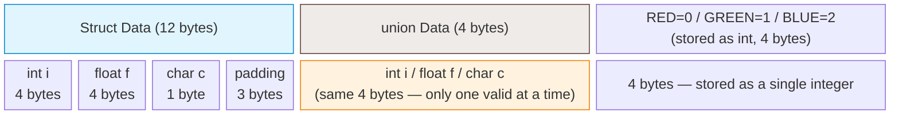
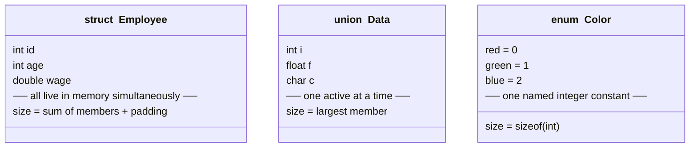

# C Programming Guide _12_

## 1. Function

A **function** is a named, reusable block of statements that performs a specific, isolated task. Every C program starts execution from a special function called main().

_**Intialization**_ 

```c
int _identifierName_ (_parameter_); // definition

int _identiferName_ (_parameter_){ // declaration
  // code
}
```

---

### Parameter vs Argument

| Term | Definition |
| :--- | :--- |
| **Parameter** | A variable declared in the function header — acts as a placeholder for incoming data |
| **Argument** | The actual value or variable passed from the caller into the function at call time |

```c
/* a and b are parameters */
int multiply(int a, int b) {
    return a * b;
}

int main(void) {
    int x = multiply(5, 6);   /* 5 and 6 are arguments */
    printf("%d\n", x);        /* 30 */
    return 0;
}
```

---

### Types of Functions

#### Void Functions (Non-returning)

A function declared with `void` executes tasks but returns no data to the caller.

```c
int printf(const char *__format, ...);   // manual prototype instead of #include

void printGreeting(const char *name) {
    printf("Good Morning %s\n", name);
}

int main() {
    printGreeting("Kairn");
    return 0;
}
```

---

#### Value-Returning Functions

A function that computes a result and passes it back to the caller using `return`.

```c
#include <stdio.h>

int add(int x, int y) {
    return x + y;
}

int main() {
    int result = add(10, 5);
    printf("%d\n", result);  // Output: 15
    return 0;
}
```

> [!NOTE]
> A `void` function executes tasks without returning data. A typed function (`int`, `double`, etc.) **must** explicitly return a matching value.

---

### 1. Pass by Value

When a function is called, all parameters are created as brand-new local variables in the **stack frame**. The value of each argument is **copied** into its matching parameter. This is called **pass by value**.  (i.e. all parameters are copies — modifying them does not affect the caller's variable.)

```c
#include <stdio.h>

int add(int x, int y) {
    return x + y;
}

int main() {
    int result = add(10, 5);
    printf("%d\n", result);  // Output: 15
    return 0;
}
```

---

### 2. Pass by pointer (simulated pass-by-reference)

To let a function modify the caller's variable, pass a pointer:

```c
void addTen(int *n) {
    *n += 10;         /* modifies the original */
}

int main(void) {
    int x = 5;
    addTen(&x);       /* pass the address */
    printf("%d\n", x);  /* prints 15 */
    return 0;
}
```

---

### Forward Declarations and Definitions

- A **declaration** tells the compiler about an identifier's name and type — no memory is allocated.
- A **definition** actually implements (for functions) or instantiates (for variables) the identifier — memory is allocated.

```c
#include <stdio.h>

int add(int x, int y); // [!NOTE] null statement

int main() {
    int result = add(10, 5);
    printf("%d\n", result);  // Output: 15
    return 0;
}

int add(int x, int y) {
    return x + y;
}
```

```c 
// both are same u don't need to write the variable name in declaration
#include <stdio.h>

int add(int, int); // [!NOTE] null statement 

int main() {
    int result = add(10, 5);
    printf("%d\n", result);  // Output: 15
    return 0;
}

int add(int x, int y) {
    return x + y;
}
```

> **Rule:** 
>- In C, all definitions are also declarations. Forward declarations allow you to call functions regardless of their order in the source file.
>- Functions cannot be nested — you cannot define a function inside another function. But, they can be called inside one another [Function calling another function](../codeContainer/funCaller.c)
>- A void function returns nothing; calling return; (no value) exits it early.
>- Always include the parentheses () when calling — greet alone is just the address of the function, not a call.

---

### Local Scope

Variables declared inside a function are **local** — they exist only during that function call and are invisible to other functions.

```c
void foo(void) {
    int local = 42;   /* only visible inside foo */
}
/* 'local' does not exist out here */
```

---

### Functions Calling Other Functions

Functions can call other functions, which can call more functions, and so on.

```c
#include <stdio.h>

void doB(void) {
    printf("In doB\n");
}

void doA(void) {
    printf("Starting doA\n");
    doB();
    printf("Ending doA\n");
}

int main(void) {
    printf("Starting main\n");
    doA();
    printf("Ending main\n");
    return 0;
}
```

---

## 2. Structures, Unions and Enums

### Program-Defined Types

C lets you define your own types using `enum`, `struct`, and `typedef`. These solve the problem of grouping related data under one meaningful name.

---

### Memory layout



> [!CAUTION]
> **In above case there is 3 data type in struct if there is 4 datatype it will be 16 and so on but enums(4 bytes always) and union(highest datatype memory) have same byte for all program**

| Type | Size | What's stored |
|------|------|---------------|
| `struct` | 12 bytes (with padding) | all three members simultaneously |
| `union` | 4 bytes (largest member) | one member at a time |
| `enums` | 4 bytes (stored as a single integer) |  named constants, not stored in memory; only the chosen int is |

---

### `typedef`

`typedef` creates an **alias** for an existing type, making code more readable and portable.

---

#### 1. Basic Syntax

```c
typedef existing_type new_name;
```

```c
typedef unsigned int uint;
uint age = 20;   // same as: unsigned int age = 20;
```

---

#### 2. `typedef` with Structs

Without `typedef`, you must write `struct` every time:

```c
// Without typedef
struct Point { int x; int y; };
struct Point p1;   // must say "struct Point"

// With typedef
typedef struct {
    int x;
    int y;
} Point;

Point p1;    // cleaner — no "struct" keyword needed
p1.x = 10;
p1.y = 20;
```

You can also name the struct and typedef it at once (needed for self-referencing):

```c
typedef struct Node {
    int data;
    struct Node *next;   // self-reference still needs "struct Node"
} Node;
```

---

#### 3. `typedef` with Pointers

```c
typedef int* IntPtr;
IntPtr a, b;   // both a and b are int* — can be confusing
               // prefer: int *a, *b; for clarity
```

---

#### 4. `typedef` with Function Pointers

Without `typedef`, function pointer syntax is hard to read:

```c
// Without typedef
int (*op)(int, int);

// With typedef
typedef int (*Operation)(int, int);   // alias for the function pointer type

int add(int a, int b) { return a + b; }
int mul(int a, int b) { return a * b; }

Operation op = add;
printf("%d\n", op(3, 4));   // prints 7

op = mul;
printf("%d\n", op(3, 4));   // prints 12
```

---

#### 5. `typedef` with Arrays

```c
typedef char Name[50];
Name first, last;   // each is char[50]
```

---

#### 6. `typedef` for Portability

Standard headers like `<stdint.h>` use `typedef` to guarantee exact sizes across platforms:

```c
#include <stdint.h>

int8_t   a;   // exactly 8 bits
int16_t  b;   // exactly 16 bits
int32_t  c;   // exactly 32 bits
int64_t  d;   // exactly 64 bits
uint8_t  e;   // unsigned 8 bits
```

These are all just `typedef` aliases under the hood — e.g. `typedef unsigned char uint8_t;`

---

#### 7. Key Points

| Situation | Without `typedef` | With `typedef` |
|-----------|-------------------|----------------|
| Struct variable | `struct Student s;` | `Student s;` |
| Function pointer | `int (*op)(int, int);` | `Operation op;` |
| Fixed-size types | `unsigned long long` | `uint64_t` |

> **`typedef` does not create a new type** — it creates a new name for an existing one. The compiler treats them identically.

---

#### 8. Common Mistakes

```c
// Confusing pointer typedef
typedef int* IntPtr;
IntPtr a, b;   // looks like two ints, but both are int*

// Clearer without typedef
int *a, *b;

// Redefining typedef in same scope
typedef int myInt;
typedef int myInt;   // error: redefinition

// Use #ifndef guard in headers
#ifndef MY_INT
#define MY_INT
typedef int myInt;
#endif
```

---

### 2.1.1 Enumerations (`enum`)

An enumeration restricts a variable to a fixed set of named integer constants called enumerators.

Without enum (bad):

```c
int appleColor = 0;   /* what does 0 mean? */
```

With enum (good):

```c
#include <stdio.h>

enum Color {
    red,    /* = 0 by default */
    green,  /* = 1 */
    blue,   /* = 2 */
};

int main(void) {
    enum Color apple = red;
    enum Color shirt = green;

    if (apple == red)
        printf("The apple is red.\n");
    return 0;
}
```

> In C (unlike C++), you must write `enum Color`, not just `Color`, unless you use `typedef`.

Using `typedef` for cleaner syntax:

```c
typedef enum {
    red,
    green,
    blue,
} Color;

Color apple = red;   /* no need to write 'enum Color' */
```

---

### 2.1.2 Enumerator Values

Enumerators are assigned integer values starting at `0` by default. You can override them:

```c
enum Direction {
    north = 1,
    south = 2,
    east  = 3,
    west  = 4,
};

enum HttpStatus {
    ok        = 200,
    not_found = 404,
    error     = 500,
};
```

If you partially assign values, subsequent enumerators continue from the last assigned value:

```c
enum Example {
    a = 5,
    b,      /* 6 */
    c,      /* 7 */
};
```

---

### 2.1.3 Printing Enumerations

Enumerators are just integers, so `printf` prints the number, not the name:

```c
enum Color { red, green, blue };

enum Color c = green;
printf("%d\n", c);        /* prints: 1 */
```

To print the name, use a helper function:

```c
const char* colorName(enum Color c) {
    switch (c) {
        case red:   return "red";
        case green: return "green";
        case blue:  return "blue";
        default:    return "unknown";
    }
}

printf("%s\n", colorName(green));   /* prints: green */
```

---

### 2.2 Structs

A struct (structure) groups multiple variables of different types under one name. Each variable inside a struct is called a member.

Defining a struct:

```c
struct Employee {
    int    id;
    int    age;
    double wage;
};
```

Declaring a variable of that type:

```c
struct Employee joe;
```

Using `typedef` for cleaner syntax (common in C):

```c
typedef struct {
    int    id;
    int    age;
    double wage;
} Employee;

Employee joe;   /* no need to write 'struct Employee' */
```

---

### 2.2.2  Accessing Struct Members — the `.` Operator

Use the member selection operator `.` to access a member of a struct variable.

```c
#include <stdio.h>

typedef struct {
    int    id;
    int    age;
    double wage;
} Employee;

int main(void) {
    Employee joe;
    joe.id   = 14;
    joe.age  = 32;
    joe.wage = 60000.0;

    printf("ID: %d, Age: %d, Wage: %.2f\n", joe.id, joe.age, joe.wage);
    return 0;
}
```

Output:

```
ID: 14, Age: 32, Wage: 60000.00
```

---

### 2.2.3 Struct Initialization

You can initialize a struct at the point of declaration using aggregate initialization (brace list):

```c
Employee joe  = { 14, 32, 60000.0 };   /* positional */
Employee frank = { .id=15, .age=28, .wage=45000.0 };  /* designated (C99+) */
```

Designated initializers (`.member = value`) are safer and more readable.

---

### 2.2.4 Multiple Struct Variables

Each struct variable is independent — members of `joe` are separate from members of `frank`.

```c
#include <stdio.h>

typedef struct {
    int    id;
    int    age;
    double wage;
} Employee;

int main(void) {
    Employee joe   = { .id=14, .age=32, .wage=60000.0 };
    Employee frank = { .id=15, .age=28, .wage=45000.0 };

    int totalAge = joe.age + frank.age;
    printf("Combined age: %d years\n", totalAge);

    if (joe.wage > frank.wage)
        printf("Joe earns more.\n");
    else
        printf("Frank earns more or equal.\n");

    frank.wage += 5000.0;   /* Frank got a raise */
    joe.age++;              /* Joe's birthday */
    return 0;
}
```

---

### 2.2.5 The Arrow Operator `->`

When you have a pointer to a struct, use `->` to access its members (instead of `(*ptr).member`).

```c
Employee* ptr = &joe;

ptr->age  = 33;         /* same as (*ptr).age = 33 */
ptr->wage = 65000.0;
```

| Situation | Operator | Example |
|---|---|---|
| Struct variable | `.` | `joe.age` |
| Pointer to struct | `->` | `ptr->age` |

---

### 2.2.6 Passing Structs to Functions

Structs are passed by value (a copy is made). To avoid copying (and to allow modification), pass a pointer.

```c
#include <stdio.h>

typedef struct {
    int id;
    int age;
} Employee;

/* Pass by value — caller's copy is unchanged */
void printEmployee(Employee e) {
    printf("ID=%d, Age=%d\n", e.id, e.age);
}

/* Pass by pointer — can modify original */
void birthday(Employee* e) {
    e->age++;   /* use -> operator with pointers to structs */
}

int main(void) {
    Employee joe = { .id=14, .age=32 };
    printEmployee(joe);
    birthday(&joe);
    printf("After birthday: Age=%d\n", joe.age);   /* 33 */
    return 0;
}
```

---

### 2.2.7 Structs Containing Structs (Nesting)

Structs can have other structs as members.

```c
typedef struct {
    int year;
    int month;
    int day;
} Date;

typedef struct {
    int  id;
    int  age;
    Date hireDate;
} Employee;

Employee e = { .id=1, .age=30, .hireDate = {2020, 6, 15} };
printf("Hired: %d/%d/%d\n", e.hireDate.year, e.hireDate.month, e.hireDate.day);
```

---

### 2.3 Unions

A `union` groups multiple members under one name — just like a `struct` — but all members **share the same memory**. The union's size equals its **largest member**, and only one member holds a valid value at any time.

---

#### 2.3.2 Declaration syntax

```c
union Data {
    int   i;
    float f;
    char  c;
};
```

With `typedef` (preferred):

```c
typedef union {
    int   i;
    float f;
    char  c;
} Data;
```

---

#### 2.3.3 Basic usage

```c
Data u;
u.i = 42;
printf("%d\n", u.i);   /* valid: 42 */

u.f = 3.14f;           /* overwrites the same bytes */
printf("%f\n", u.f);   /* valid: 3.14 */
/* u.i is now garbage — do NOT read it */
```

Only the **most recently written** member is safe to read. Reading any other member is undefined behaviour.

---

#### 2.3.4 Accessing members — same operators as struct

| Situation | Operator | Example |
|-----------|----------|---------|
| Union variable | `.` | `u.i` |
| Pointer to union | `->` | `ptr->i` |

```c
Data  u   = { .i = 7 };   /* designated initialiser */
Data *ptr = &u;

ptr->i = 99;               /* same as (*ptr).i = 99 */
```

---

#### 2.3.5 The golden rule

```
Write member A → only member A is valid.
Then write member B → only member B is valid.
Reading A after writing B = undefined behaviour.
```

---

#### 2.3.6 Tagged union — the standard pattern

A `union` alone cannot tell you *which* member is currently active. Pair it with an `enum` tag inside a `struct`:

```c
typedef enum { TYPE_INT, TYPE_FLOAT, TYPE_CHAR } Tag;

typedef struct {
    Tag tag;        /* records which member is valid */
    union {
        int   i;
        float f;
        char  c;
    } value;
} Variant;
```

Usage:

```c
Variant a = { .tag = TYPE_INT,   .value.i = 42    };
Variant b = { .tag = TYPE_FLOAT, .value.f = 3.14f };

void printVariant(Variant v) {
    switch (v.tag) {
        case TYPE_INT:   printf("int:   %d\n",  v.value.i); break;
        case TYPE_FLOAT: printf("float: %f\n",  v.value.f); break;
        case TYPE_CHAR:  printf("char:  %c\n",  v.value.c); break;
    }
}
```

The `tag` field is the contract: always check it before reading `value`.

---

#### 2.3.7 Anonymous union (C11)

When a union is nested inside a struct without a member name, its members are accessed directly:

```c
typedef struct {
    Tag tag;
    union {          /* no member name — anonymous union */
        int   i;
        float f;
        char  c;
    };               /* members accessed as v.i, v.f, v.c */
} Variant;

Variant v = { .tag = TYPE_INT, .i = 42 };
printf("%d\n", v.i);   /* no .value. needed */
```

> Anonymous unions require C11 (`-std=c11`) or a compiler extension.

---

#### 2.3.8 struct vs union vs enum — quick reference



| Feature | `struct` | `union` | `enum` |
|---------|----------|---------|--------|
| Holds | all members at once | one member at a time | one named integer |
| Size | sum + padding | largest member | `sizeof(int)` |
| Member access | `.` or `->` | `.` or `->` | by name directly |
| Main use | grouping related fields | memory-efficient variants | named constants / state |

---

#### 2.3.9 Common real-world uses

**1. Type-punning (inspecting raw bytes):**

```c
typedef union {
    float    f;
    uint32_t bits;
} FloatBits;

FloatBits fb = { .f = 1.0f };
printf("0x%08X\n", fb.bits);   /* see the IEEE 754 bit pattern */
```

**2. Network / protocol headers (overlapping interpretations of the same bytes):**

```c
typedef union {
    uint32_t raw;
    struct { uint8_t a, b, c, d; } octets;
} IPv4Addr;
```

**3. Variant / sum type (see tagged union above):**  
Used extensively in compilers, interpreters, and AST node types to represent a value that could be one of several different things.

---

#### 2.3.10 Initialisation rules

```c
Data u1 = { 42 };           /* initialises FIRST member (int i) */
Data u2 = { .f = 3.14f };   /* designated — initialises float f (C99+) */
```

Only one member can be initialised; the rest share those bytes.

---

## 3. Pointers

A **pointer** is a variable that holds the **memory address** of another variable.

**Declaration syntax:**
```c
int*   ptr;    // pointer to an int
float* fptr;   // pointer to a float
char*  cptr;   // pointer to a char
```

> Best practice: place the `*` next to the type (`int* ptr`), not the name.

---

### 3.1 Initializing a pointer

```c
int x = 5;
int* ptr = &x;   // ptr now holds the address of x
```

> Always initialize pointers. An uninitialized pointer (a "wild pointer") holds a garbage address — dereferencing it causes undefined behaviour.

---

### 3.2 The Address-of Operator `&`

Every variable lives at a memory address. The **address-of operator** `&` retrieves that address.

```c
#include <stdio.h>

int main(void) {
    int x = 5;
    printf("Value:   %d\n", x);
    // this is better as %p expects a void * — this is what the C standard actually requires
    printf("Address: %p\n", (void*)&x); 
    printf("Address: %p\n", &x);
    return 0;
}
```

Output (example):

```bash
Value:   5
Address: 000000a70d9ff79c
```

---

### 3.3 The Dereference Operator `*`

The **dereference operator** `*` retrieves the value stored at the address a pointer holds.

```c
#include <stdio.h>

int main(void) {
    int x = 5;
    int* ptr = &x;

    printf("Address in ptr:  %p\n", (void*)ptr);
    printf("Value at ptr:    %d\n", *ptr);   /* dereference */

    *ptr = 99;   /* change x through the pointer */
    printf("x is now:        %d\n", x);
    return 0;
}
```

Output:
```
Address in ptr:  0x7ffee1b2c4ac
Value at ptr:    5
x is now:        99
```

**`&` and `*` are opposites:**
| Operator | Name | Does |
|---|---|---|
| `&x` | address-of | gives the address of `x` |
| `*ptr` | dereference | gives the value at the address in `ptr` |

---

### 3.4 Pointer Types Must Match

A pointer's type must match the type of the variable it points to.

```c
int    i   = 5;
double d   = 7.0;
int*   ip  = &i;   /* OK */
double* dp = &d;   /* OK */
int*   bad = &d;   /* ERROR: type mismatch */
```

---

### 3.5 Null Pointers

A **null pointer** holds no valid address. Use `NULL` (from `<stddef.h>`) or the literal `0`.

```c
#include <stdio.h>
#include <stddef.h>

int main(void) {
    int* ptr = NULL;

    if (ptr == NULL) {
        printf("Pointer is null — don't dereference it!\n");
    }
    return 0;
}
```

> Never dereference a null pointer — it causes a crash (segmentation fault).

---

### 3.6 Changing What a Pointer Points To

You can reassign a pointer to a different variable at any time.

```c
int x = 5;
int y = 6;
int* ptr = &x;

printf("%d\n", *ptr);   /* 5 */

ptr = &y;               /* now points to y */
printf("%d\n", *ptr);   /* 6 */
```

---

### 3.7 Pass by Pointer (C's "Pass by Reference")

C only has pass-by-value. To let a function modify the caller's variable, pass a **pointer**.

```c
#include <stdio.h>

void addTen(int* n) {
    *n += 10;            /* modify through pointer */
}

int main(void) {
    int x = 5;
    addTen(&x);          /* pass address of x */
    printf("%d\n", x);   /* 15 */
    return 0;
}
```

---

### 3.8 Const Pointers

There are two different "const" combinations with pointers:

```c
int x = 5;
int y = 10;

// 1. Pointer to const — can't change the VALUE through the pointer
const int* ptr1 = &x;
// *ptr1 = 99;  ERROR 
ptr1 = &y;             // OK — can change where ptr1 points

// 2. Const pointer — can't change WHERE the pointer points
int* const ptr2 = &x;
*ptr2 = 99;            // OK — can change the value
// ptr2 = &y;  ERROR 

// Const pointer to const — neither can 
const int* const ptr3 = &x;
```

---

### 3.9 Pointer Arithmetic

Pointers support arithmetic — adding `n` moves the pointer forward by `n` elements (not bytes).

```c
int arr[] = {10, 20, 30, 40};
int* ptr = arr;           /* points to arr[0] */

printf("%d\n", *ptr);     /* 10 */
ptr++;                    /* advance to arr[1] */
printf("%d\n", *ptr);     /* 20 */
printf("%d\n", *(ptr+1)); /* 30 — arr[2] */
```

This is the foundation of how arrays and loops work together in C.

---

### 3.10 Function Pointers

A **function pointer** stores the address of a function and allows calling it indirectly.

```c
#include <stdio.h>

int add(int a, int b) { return a + b; }
int sub(int a, int b) { return a - b; }

int main(void) {
    int (*op)(int, int);   /* pointer to a function taking 2 ints, returning int */

    op = add;
    printf("add: %d\n", op(3, 4));   /* 7 */

    op = sub;
    printf("sub: %d\n", op(3, 4));   /* -1 */
    return 0;
}
```

> [!CAUTION] yes, when u call the function without parenthesis() it gives the address of the function i.e. it doesnot call the function.

> Yes, int* a and int *a are completely identical to the compiler. (better to use typedef)

| Style | Philosophical Focus | Meaning to the Human Eye |
| :--- | :--- | :--- |
| `int* a;` | **The Type** | "The type of variable `a` is an integer-pointer (`int*`)." |
| `int *a;` | **The Syntax** | "If I dereference `*a`, the resulting value will be an `int`." |

### The Multi-Variable Trap (Why int *a is safer)
- While the compiler treats them the same for a single variable, a major trap occurs if you try to declare multiple pointers on a single line using a separator comma.

- The compiler binds the asterisk (*) only to the immediate variable name next to it, not to the base type.

```C
int* a, b;
```
> [!WARNING]
> **What you might think it means:**
> Both `a` and `b` are integer pointers (`int*`).

> [!CAUTION]
> **What it actually means to the compiler:**
> `a` is a pointer to an integer (`int*`), but `b` is just a regular, normal integer (`int`).

> [!NOTE]
> To make both of them pointers on the same line, you are forced to attach the asterisk to both names:

```C
int *a, *b; // Both are now pointers
```

---

### 3.11 Pointer to union

```c
Data  u   = { .i = 10 };
Data *ptr = &u;

ptr->i = 20;    /* write through pointer */
printf("%d\n", ptr->i);   /* 20 */
```

Passing by pointer also allows modification of the original (same pattern as structs):

```c
void setInt(Data *d, int val) {
    d->i = val;
}
```

---

## 4. Working with Files

Files let programs persist data beyond a single run. C provides file I/O through the standard library `<stdio.h>`, using a `FILE *` pointer as a handle to every open file.

```c
#include <stdio.h>

int main(void) {
    /* Writing to a file */
    FILE* fp = fopen("data.txt", "w");
    if (fp == NULL) {
        perror("Error opening file");
        return 1;
    }
    fprintf(fp, "Hello, file!\n");
    fclose(fp);                          /* always close */

    /* Reading from a file */
    fp = fopen("data.txt", "r");
    char buf[100];
    fgets(buf, sizeof(buf), fp);
    printf("Read: %s", buf);
    fclose(fp);

    return 0;
}
```

### The File Modes

| Mode | Description | If file exists... | If file doesn't exist... |
| :--- | :--- | :--- | :--- |
| **`"r"`** (Read) | Opens for reading. | Opens normally. | Returns `NULL` (Error). |
| **`"w"`** (Write) | Opens for writing. | **Wipes it completely blank.** | Creates a new file. |
| **`"a"`** (Append) | Opens for writing at the end. | Keeps old data, adds to bottom. | Creates a new file. |
| **`"r+"`** | Opens for both reading & writing. | Opens normally at the beginning. | Returns `NULL` (Error). |
| **`"w+"`** | Opens for reading & writing. | **Wipes it completely blank.** | Creates a new file. |
| **`"a+"`** | Opens for reading & appending. | Keeps old data, reads from start. | Creates a new file. |

### Standard Screen & Keyboard I/O Syntax

```c
printf("format string", variables);

scanf("format string", &variables);

putchar(character_variable);

character_variable = getchar();

puts(string_variable);
```

### File I/O Syntax

```c
fprintf(file_pointer, "format string", variables);

fscanf(file_pointer, "format string", &variables);

fputc(character_variable, file_pointer);

character_variable = fgetc(file_pointer);

fputs(string_variable, file_pointer);

fgets(string_buffer, maximum_length, file_pointer);
```

### String / Memory I/O Syntax

```c
sprintf(string_buffer, "format string", variables);

sscanf(source_string, "format string", &variables);
```

### Console I/O Syntax (Conio.h)

```c
character_variable = getch();

character_variable = getche();
```

### 4.1 The FILE Pointer

```c
#include <stdio.h>

FILE *fp;   // pointer to a file stream
```

Every file operation goes through this pointer. It holds the current position, buffering state, and error flags.

---

### 4.2 Opening and Closing Files — `fopen` / `fclose`

### `fopen`

```c
FILE *fopen(const char *filename, const char *mode);
```

| Mode | Meaning |
|------|---------|
| `"r"` | Read (file must exist) |
| `"w"` | Write (creates or truncates) |
| `"a"` | Append (creates if absent) |
| `"r+"` | Read + write (file must exist) |
| `"w+"` | Read + write (creates or truncates) |
| `"a+"` | Read + append |
| `"rb"`, `"wb"` … | Binary variants of the above |

Returns `NULL` on failure — always check.

```c
FILE *fp = fopen("data.txt", "r");
if (fp == NULL) {
    perror("fopen");   // prints OS error message
    return 1;
}
```

### `fclose`

```c
int fclose(FILE *fp);
```

Flushes the buffer and releases the file. Returns `0` on success, `EOF` on error.

```c
fclose(fp);
```

> **Rule:** every `fopen` must have a matching `fclose`.

---

### 4.3 Character I/O — `getc` / `putc`

Read or write one character at a time.

### `getc`

```c
int getc(FILE *fp);
```

Returns the next character as an `unsigned char` cast to `int`, or `EOF` at end-of-file or on error.

```c
int ch;
while ((ch = getc(fp)) != EOF) {
    putchar(ch);   // echo to stdout
}
```

### `putc`

```c
int putc(int ch, FILE *fp);
```

Writes one character. Returns the character written, or `EOF` on error.

```c
putc('A', fp);
```

> `fgetc` / `fputc` are equivalent functions (not macros) — safe to use with side-effect arguments.

---

### 4.4 Integer I/O — `getw` / `putw`

Read or write a machine-word integer (platform-specific size).

### `getw`

```c
int getw(FILE *fp);
```

Reads one `int` from a binary file. Returns `EOF` on end-of-file or error (check `feof`/`ferror` to distinguish).

### `putw`

```c
int putw(int w, FILE *fp);
```

Writes one `int` to a binary file. Returns the value written, or `EOF` on error.

```c
// Write
FILE *fp = fopen("nums.bin", "wb");
putw(42, fp);
fclose(fp);

// Read back
fp = fopen("nums.bin", "rb");
int n = getw(fp);   // n == 42
fclose(fp);
```

> `getw`/`putw` are **non-portable** (int size varies). Prefer `fread`/`fwrite` for binary data.

---

### 4.5 Formatted I/O — `fprintf` / `fscanf`

Mirror of `printf`/`scanf` but targeting a file.

### `fprintf`

```c
int fprintf(FILE *fp, "Format String", argument1, argument2, ...);
```

```c
FILE *fp = fopen("log.txt", "w");
fprintf(fp, "Score: %d\nName: %s\n", 95, "Alice");
fclose(fp);
```

### `fscanf`

```c
int fscanf(FILE *fp, "Format String", argument1, argument2, ...);
```

Returns the number of items successfully read, or `EOF`.

```c
int score;
char name[50];
FILE *fp = fopen("log.txt", "r");
fscanf(fp, "Score: %d\nName: %s\n", &score, name);
fclose(fp);
```

> Watch for whitespace handling — `fscanf` skips leading whitespace for most specifiers but not `%c`.

---

### 4.6 Block I/O — `fread` / `fwrite`

Read or write raw blocks of binary data. Preferred for structs and arrays.

### `fwrite`

```c
size_t fwrite(const void *ptr, size_t size, size_t count, FILE *fp);
```

| Parameter | Meaning |
|-----------|---------|
| `ptr` | Pointer to data |
| `size` | Size of each element (bytes) |
| `count` | Number of elements |
| `fp` | File pointer |

Returns the number of elements actually written.

```c
typedef struct {
    char name[20];
    int  score;
} Student;

Student s = {"Alice", 95};
FILE *fp = fopen("students.bin", "wb");
fwrite(&s, sizeof(Student), 1, fp);
fclose(fp);
```

### `fread`

```c
size_t fread(void *ptr, size_t size, size_t count, FILE *fp);
```

Returns the number of elements actually read (may be less than `count` at end-of-file).

```c
Student s;
FILE *fp = fopen("students.bin", "rb");
fread(&s, sizeof(Student), 1, fp);
printf("%s: %d\n", s.name, s.score);
fclose(fp);
```
<!-- 
---

// for those who are curious

### 4.7. File Positioning

Move the read/write position within a file.

### `fseek`

```c
int fseek(FILE *fp, long offset, int whence);
```

| `whence` | Meaning |
|----------|---------|
| `SEEK_SET` | From beginning of file |
| `SEEK_CUR` | From current position |
| `SEEK_END` | From end of file |

```c
fseek(fp, 0, SEEK_SET);    // rewind to start
fseek(fp, 10, SEEK_CUR);   // skip 10 bytes forward
fseek(fp, -4, SEEK_END);   // 4 bytes before end
```

### `ftell`

```c
long ftell(FILE *fp);
```

Returns the current byte offset, or `-1L` on error.

```c
long pos = ftell(fp);
```

### `rewind`

```c
void rewind(FILE *fp);
```

Equivalent to `fseek(fp, 0, SEEK_SET)` and clears error flags.

---

## 8. Error Checking

### `feof`

```c
int feof(FILE *fp);
```

Returns non-zero if the end-of-file indicator is set. Check **after** a read fails, not before.

### `ferror`

```c
int ferror(FILE *fp);
```

Returns non-zero if an error occurred on the stream.

### `clearerr`

```c
void clearerr(FILE *fp);
```

Clears both the EOF and error indicators.

```c
int ch = getc(fp);
if (ch == EOF) {
    if (feof(fp))   printf("End of file\n");
    if (ferror(fp)) perror("Read error");
}
```
 -->
---

### 4.7 Line I/O — `fgets` / `fputs`

### `fgets`

```c
char *fgets(char *buf, int n, FILE *fp);
```

Reads up to `n-1` characters, stops at `\n` (kept) or EOF. Returns `buf`, or `NULL` on EOF/error. **Safer than `gets`.**

```c
char line[256];
while (fgets(line, sizeof(line), fp) != NULL) {
    printf("%s", line);
}
```

### `fputs`

```c
int fputs(const char *str, FILE *fp);
```

Writes a string (no automatic newline). Returns non-negative on success, `EOF` on error.

```c
fputs("Hello, file!\n", fp);
```

### 4.8 File Restructuring

`rename` can the name of a file in the current working directory (using a relative path), or it can move and rename a file in a completely different directory (using an absolute path).

`remove` can delete a file from the current directory by using just its name, or from a different directory by providing the full path.

Syntax:

```c
rename(oldFileName, newFileName);
remove(fileName);
```

### 4.9 Complete Example

[Example 1 fputs and fgets](../codeContainer/fPutsGets.c)
[Example 2 fread and fwrite](../codeContainer/fWriteRead.c)
[Example 3 rename and remove](../codeContainer/fRenameRemove.c)


---

### 4.10 Quick Reference

| Function | Header | Purpose |
|----------|--------|---------|
| `fopen` | `<stdio.h>` | Open a file |
| `fclose` | `<stdio.h>` | Close a file |
| `getc` | `<stdio.h>` | Read one character |
| `putc` | `<stdio.h>` | Write one character |
| `getw` | `<stdio.h>` | Read one int (binary) |
| `putw` | `<stdio.h>` | Write one int (binary) |
| `fscanf` | `<stdio.h>` | Formatted read |
| `fprintf` | `<stdio.h>` | Formatted write |
| `fread` | `<stdio.h>` | Read binary block |
| `fwrite` | `<stdio.h>` | Write binary block |
| `fgets` | `<stdio.h>` | Read a line |
| `fputs` | `<stdio.h>` | Write a string |
| `rename` | `<stdio.h>` | renames a file |
| `remove` | `<stdio.h>` | removes a file |
| `fseek` | `<stdio.h>` | Move file position |
| `ftell` | `<stdio.h>` | Get file position |
| `rewind` | `<stdio.h>` | Reset to start |
| `feof` | `<stdio.h>` | Check end-of-file |
| `ferror` | `<stdio.h>` | Check stream error |
| `clearerr` | `<stdio.h>` | Clear error flags |
| `perror` | `<stdio.h>` | Print OS error message |

---

### 4.11 Common Pitfalls

- **Not checking `fopen` return** — always test for `NULL`.
- **Mixing text and binary modes** — use `"rb"`/`"wb"` for binary data; `"r"`/`"w"` for text.
- **Using `getw`/`putw` across platforms** — `int` size differs; use `fread`/`fwrite` with `int32_t` instead.
- **Forgetting `fclose`** — unflushed buffers mean lost data.
- **Testing `feof` before reading** — `feof` is only reliable after a read returns `EOF`.
- **Buffer overflow with `fscanf`** — always limit string width: `fscanf(fp, "%49s", name)`.

---

*End of C Programming Guide Grade 12*
*&#169;2026 bamboo grass*